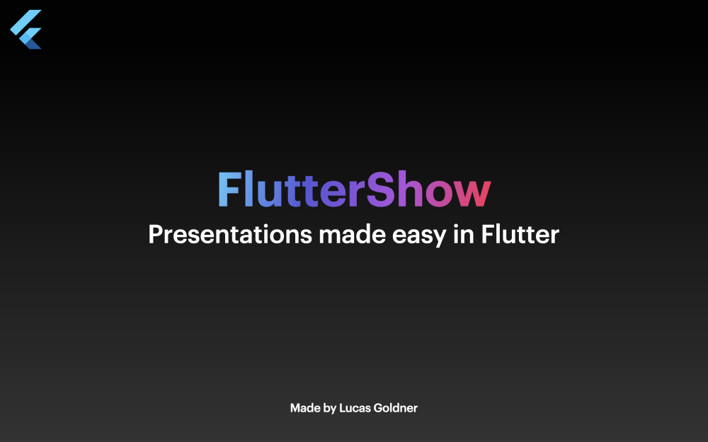

# FlutterShow⚡️ - Presentations in Flutter

[](https://pub.dev/packages/very_good_analysis)
[](https://opensource.org/licenses/MIT)

Unleash your creativity with presentations like never before! FlutterShow⚡️ is an easy-to-use framework built in Flutter for crafting engaging and interactive presentations.

Check out the full documentation showcasing all slides and code snippets to speed up your development time here: https://flutter-show-docs.vercel.app/#/



## General Information

FlutterShow consists of two main packages: `fluttershow_base` and `fluttershow_keynote`:

- [fluttershow_base](https://github.com/lucas-goldner/fluttershow_base) contains most of the pre-built widgets that are used in `fluttershow_keynote`, but can also be used to make custom slides.
- [fluttershow_keynote](https://github.com/lucas-goldner/fluttershow_keynote) is currently the default package and implements all basic slides with variations of the popular presentation software Keynote.
- The project utilizes riverpod hooks for state management, providing a simple and quick experience for managing your state.
- The project is designed to be easily expandable and customizable according to your preferences. You can switch libraries like `intl` to `easy_localizations` or use `fluttergen` for asset organization.

Any more questions? Ask them in our discord: https://discord.gg/xC6wtbzZnP

## Project Setup

### Usage

Feel free to either fork or clone the repo, whatever you prefer.
When selecting a branch check out `main` if you would like to use the latest stable version or go for the current release branch `release/1.1.0` if you want to have the newest features.

### Running FlutterShow⚡️

```bash
# Clone repo
$ git clone git@github.com:lucas-goldner/FlutterShow.git

# (Optional) Checkout branch for newest features
$ git checkout release/1.1.0

# Get dependencies
$ flutter pub get

# If language files were not generated
$ flutter pub run intl_utils:generate

# (Optional) if you want to run it on macOS
$ cd macos && pod install && cd ..

# Run the app (for example on macOS) OR use the pre-built `launch.json`
$ flutter run -d macos
```

## Getting Started

- When you first explore the project, you'll find some sample slides that demonstrate how slides are built in this project.

  You have the option to utilize these as templates or completely discard them to begin anew.

- To create a new slide, add a new widget in the [`lib/slides`](lib/slides) directory.
- Once you finish creating your slide, navigate to [`lib/presentation/config/pages_of_presentation.dart`](lib/presentation/config/pages_of_presentation.dart) and add a new member to the enum using your new widget.
- Reload the app, and your slide will appear in all its glory! 🔥

## Awesome features

### Menu

The **Menu** _(Open using **M key**)_: Toggle dark/light mode depending on the location you are presenting at or quickly jump between your slides.


### Animations

Most slides and prebuilt widgets can be animated for a smoother experience. Simply pass an `animationIndex` parameter to enable animation on the desired slide or widget.
In addition to animating individual slides and widgets, you can also animate the transitions between slides. An example of slide transition animation can be found in [`lib/slides/03_motivation/view/motivation.dart`](lib/slides/03_motivation/view/motivation.dart) file.

### Rebindable Keys

You can easily rebind your keys for actions like navigating to the next or previous slide and opening the menu. Simply edit the actions in [`lib/presentation/config/key_actions.dart`](lib/presentation/config/key_actions.dart).
